# Web app for licensed software catalogue

## Overview

This web application allows users to browse a catalogue of licensed software, search and filter products, and view detailed product information. It supports user registration, authentication, and role-based access control.

An admin panel is provided for managing database content (categories, vendors, and products).

## Demo

Unauthenticated users can access only the homepage:

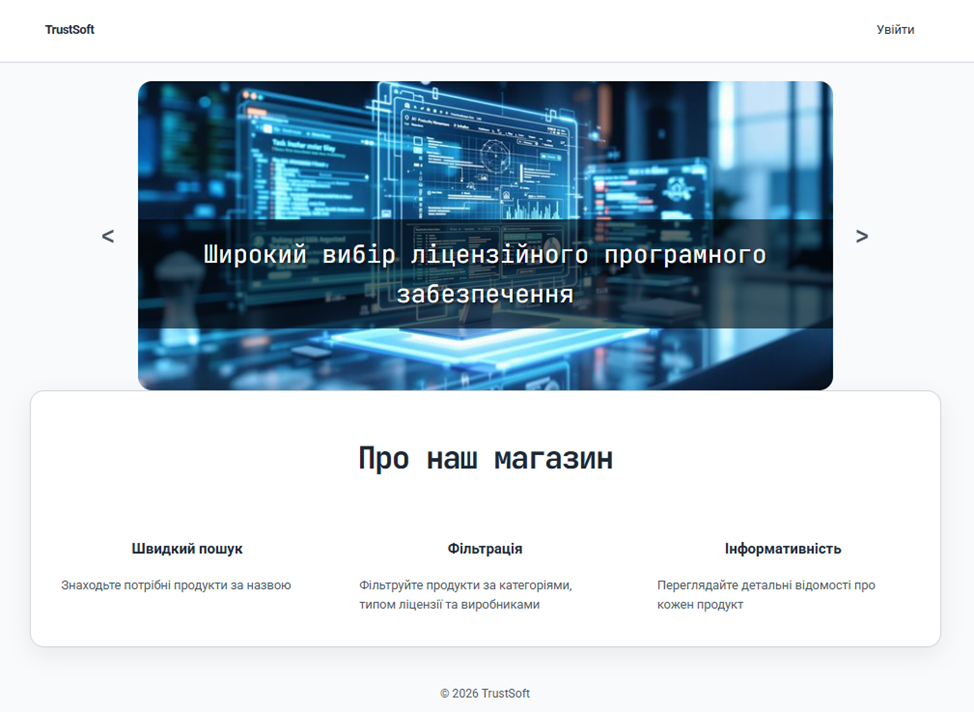

From there, they can navigate to the login page:

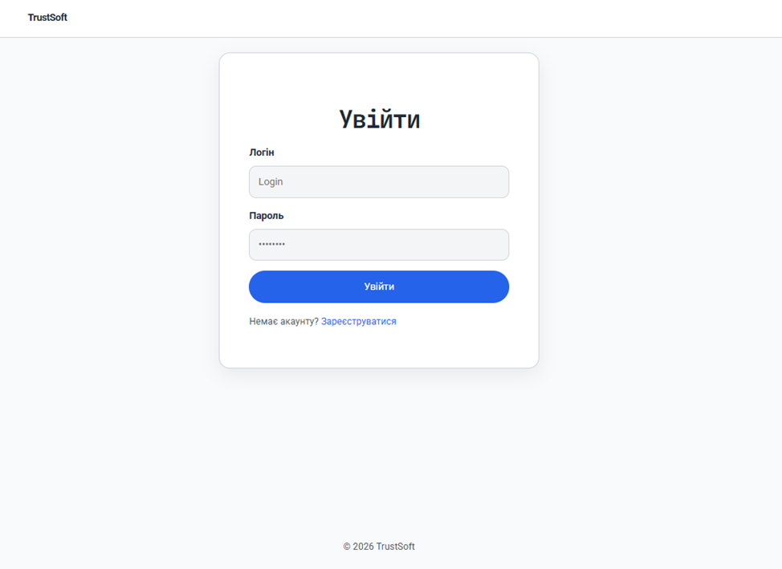

If they don’t have an account, they can sign up first:

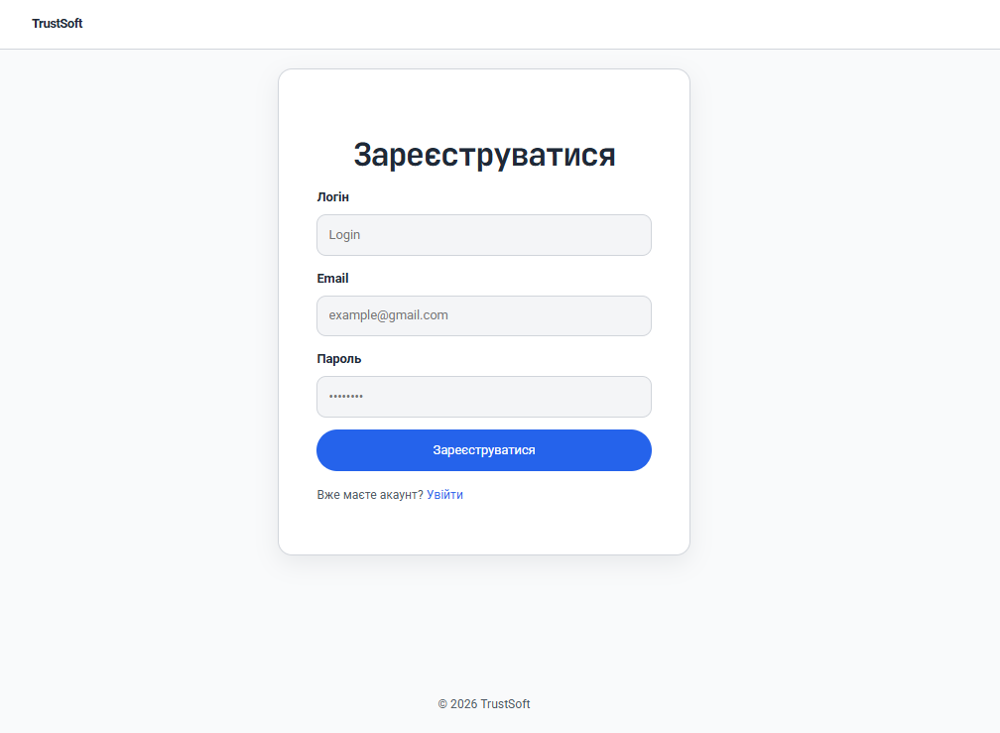

After login, users are redirected based on their role to either the admin panel or the catalogue page.

### Admin panel

Administrators can perform CRUD operations on categories, vendors, and products:

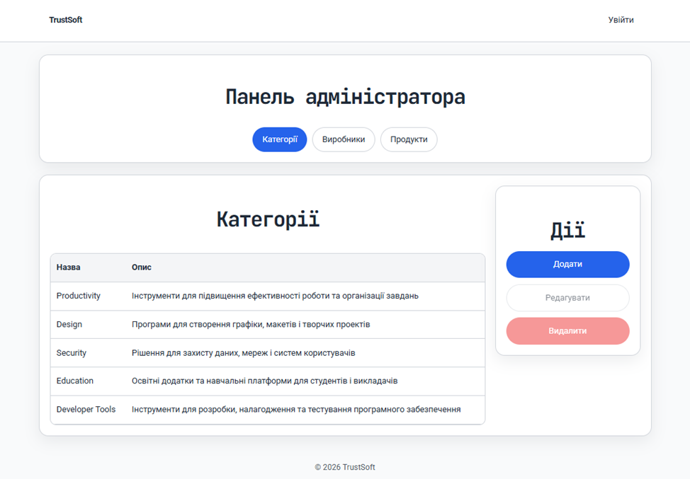
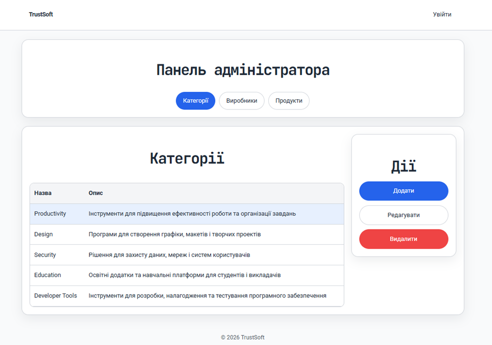
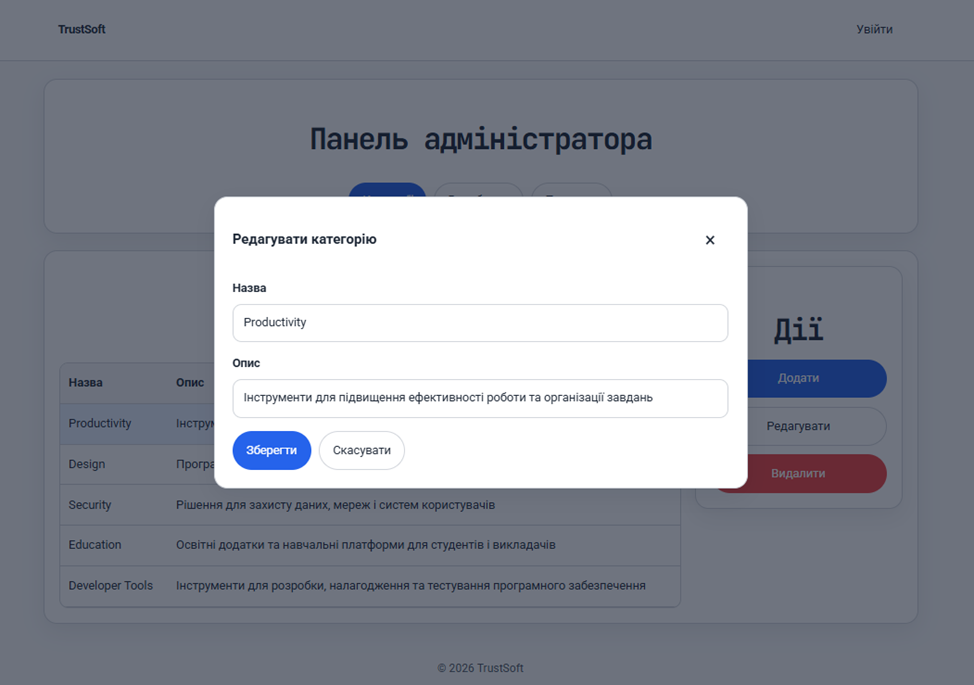
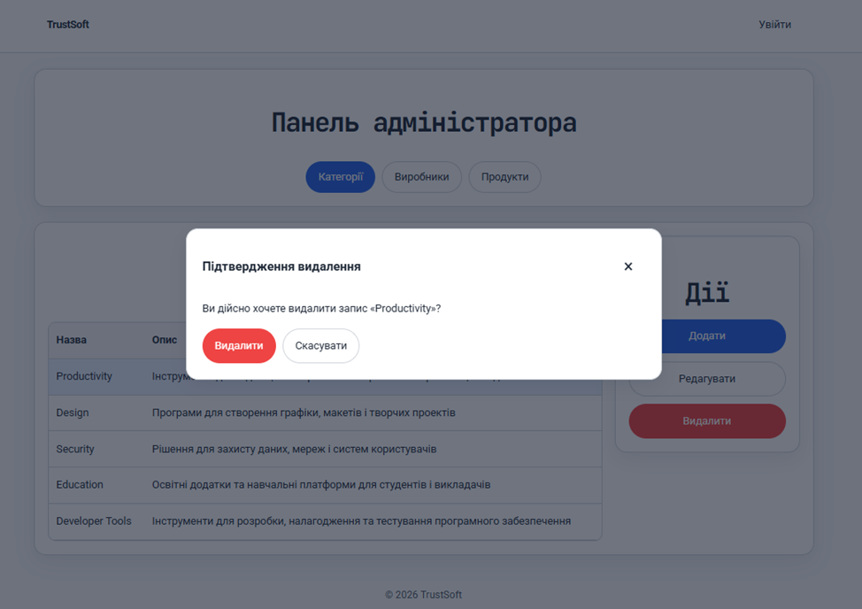

### Catalogue

Non-admin users can view available products, filter them by category, vendor, and license type, and search by name:

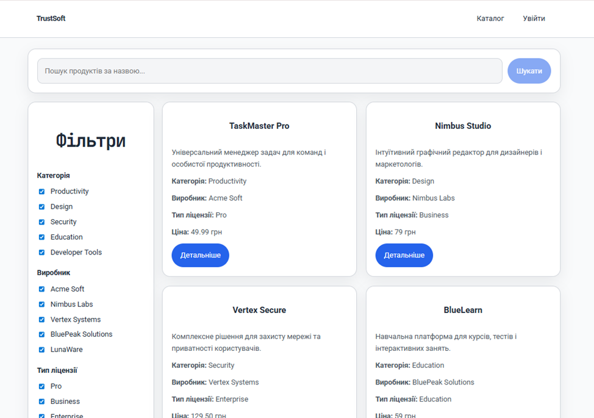
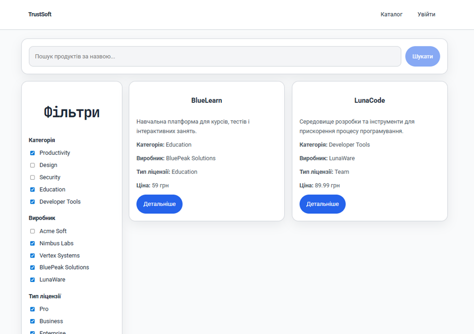
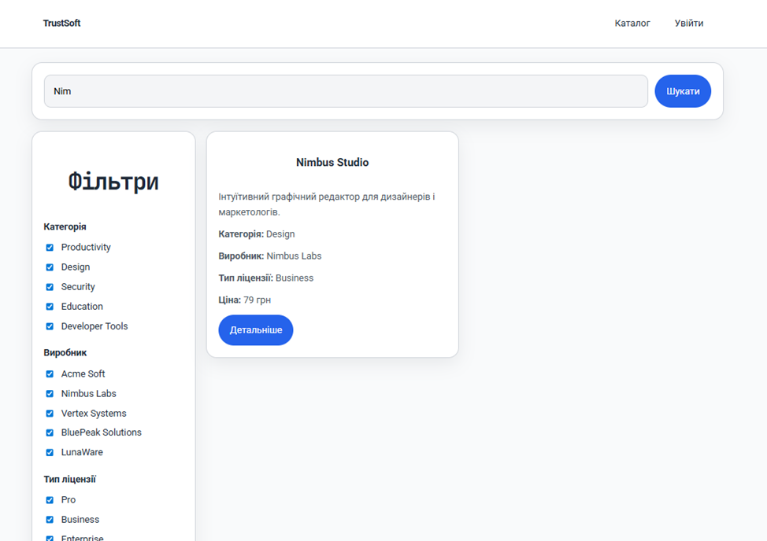

After clicking the "Детальніше" button, users are redirected to the product details page:

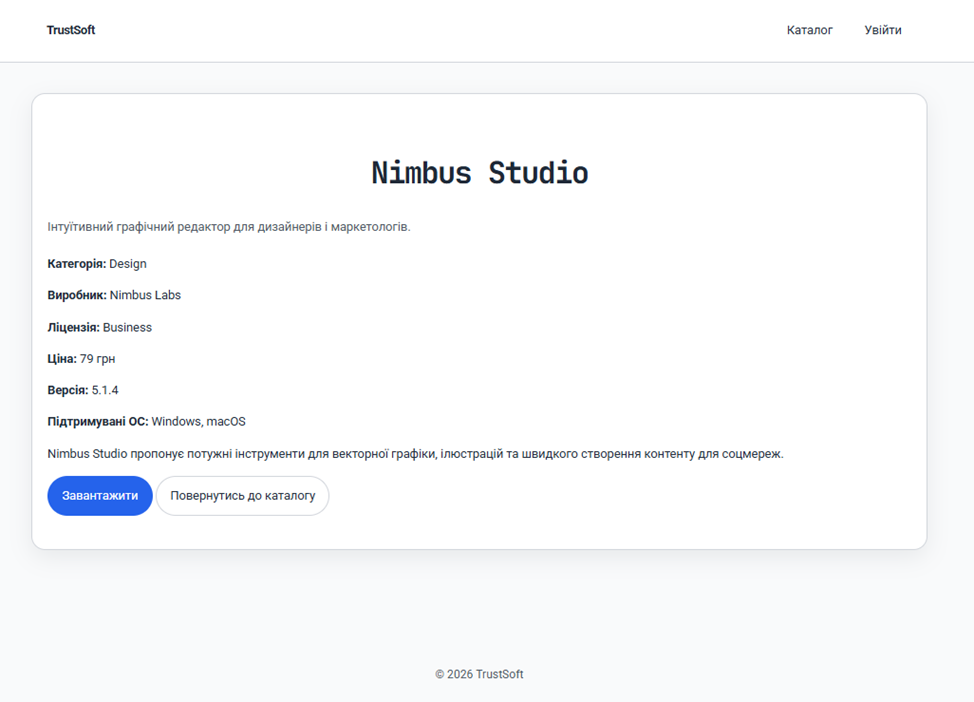

They can view the download URL by clicking the "Завантажити" button:

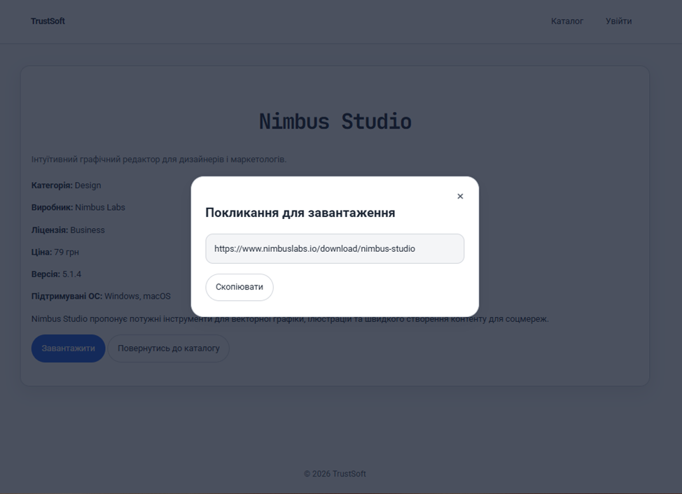

## Architecture

- `models/` contains JavaScript classes representing the business entities.
- `gui/` contains web pages: HTML, CSS, and JS for dynamic content generation.
- User input validation is done in JS class constructors, so page scripts do not perform extra checks.
- `db/dataService.js` acts as a client-side wrapper for the PHP API, handling requests to the backend and managing data exchange with the database (not implemented yet).

## How to run Frontend

1. Clone this repository:
   ```bash
   git clone https://github.com/SophiaBaranova/licensed_software.git
   ```
2. Start the local server:
   ```bash
   python -m http.server 8000
   ```
3. Open the homepage in the browser: http://localhost:8000/gui/homepage/index.html
